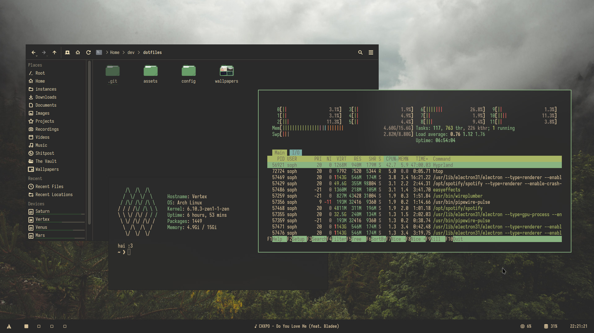
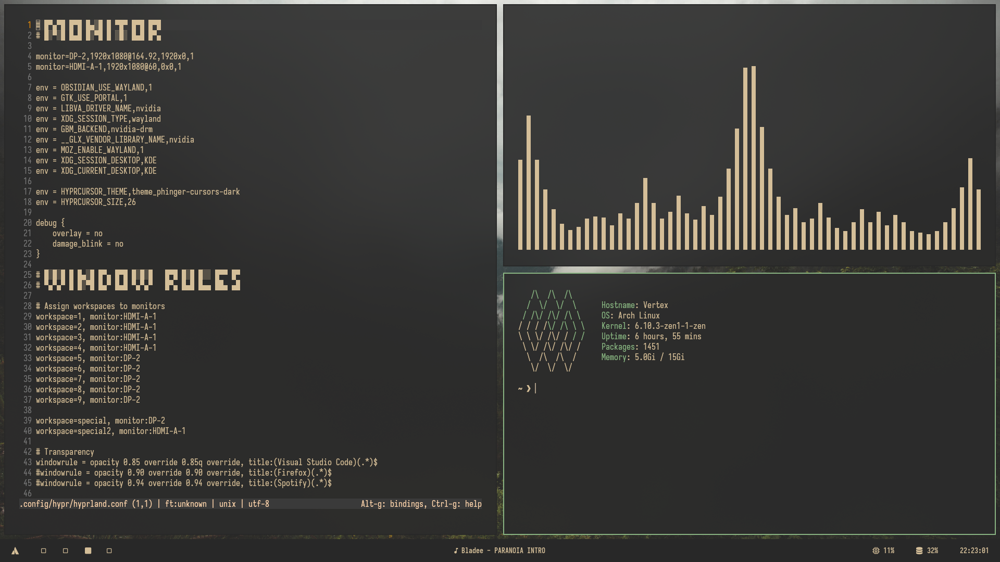

# Dotfiles

> Looking for my old config? Find it [here](https://github.com/Sophed/dotfiles/tree/x11)

- Colours: [Gruvbox Material](https://github.com/sainnhe/gruvbox-material)
- Compositor: [Hyprland](https://hyprland.org/)
- Bar: [Waybar](https://github.com/Alexays/Waybar)
- Launcher: [Tofi](https://github.com/philj56/tofi) (and rofi for shell commands)
- Terminal: [Kitty](https://sw.kovidgoyal.net/kitty/)
- Shell: [Fish](https://fishshell.com/)

